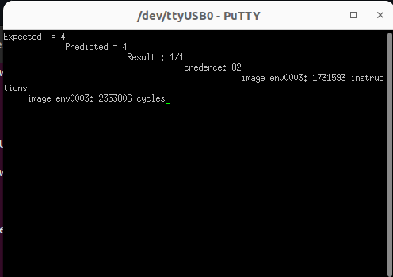
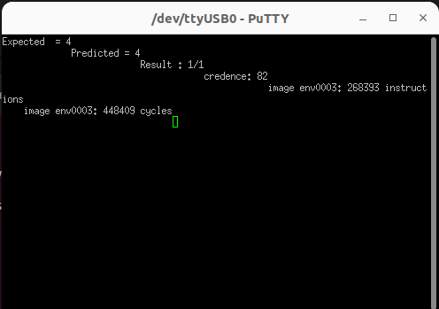
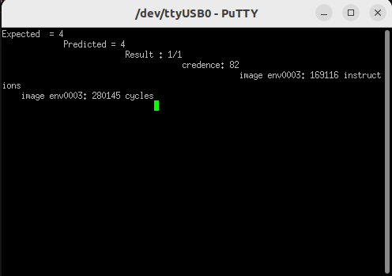

# Results section

In the following images, we can observe the results usign the 2 solutions proposed compared to the original challenge

**Note**: All the images below are testes on the FPGA

## Original

## No Buffer Solution

## Final Solution

## Table Comparison

|  | N Instructions | Cycles | Improvement |
|--------|----------|----------------|-----------|
| Original  | 1731593 | 2353806 | 1 |
| No Buffer | 268393 | 448409 | 5.25 |
| Final Solution | 169116 | 280145 | **8.40** |